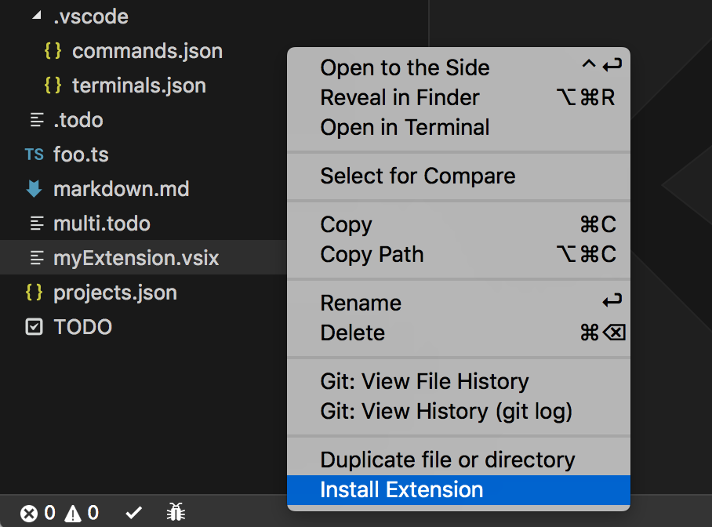

# Install .VSIX

<p align="center">
	
</p>

Install .vsix extensions right from the explorer, with a right click.

## Install

Follow the instructions in the [Marketplace](https://marketplace.visualstudio.com/items?itemName=fabiospampinato.vscode-install-vsix), or run the following in the command palette:

```shell
ext install fabiospampinato.vscode-install-vsix
```

## Usage

Right click a .vsix file from the explorer and select `Install Extension`:



## License

MIT © Fabio Spampinato
